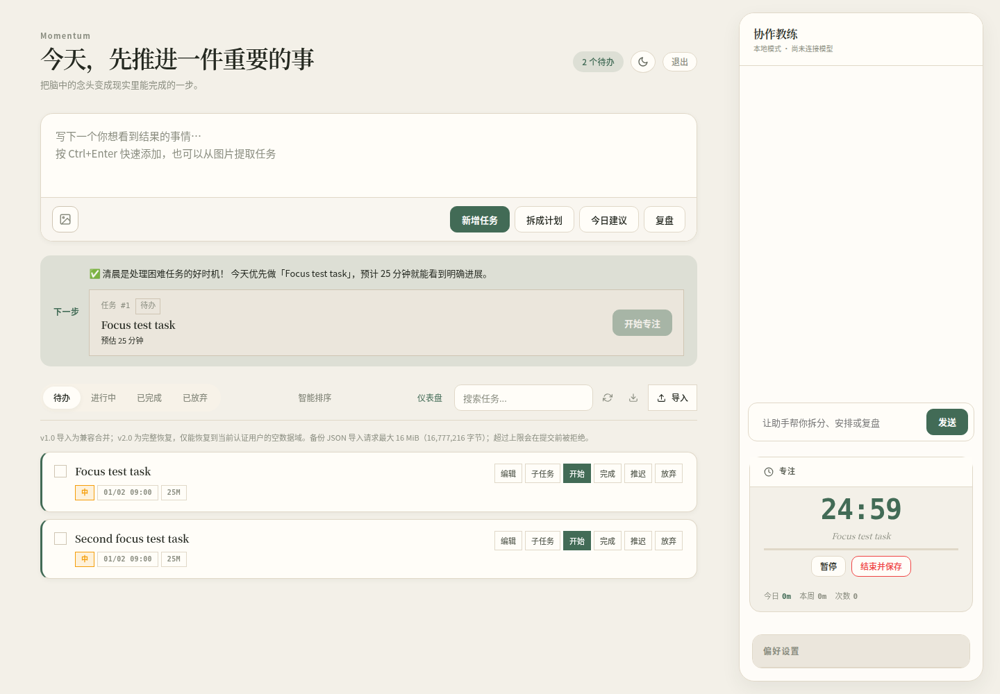
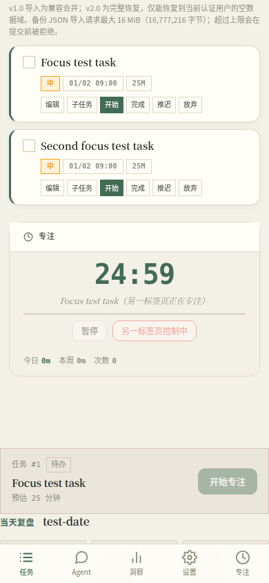

# Momentum

> 不是「又一个待办清单」，而是一个会陪你把事做完的 AI 任务系统。

[English](./README.en.md)

Momentum 是一个 **本地优先（Local-first）** 的任务与专注系统，通过 Web 工作台和 CLI 覆盖从规划到复盘的日常流程：
- 自然语言录入任务、拆解复杂目标，并管理任务状态、截止时间、标签与依赖关系。
- 从任务卡、下一步建议或今日回顾开始专注；计时支持暂停、恢复和结束，并记录实际专注时长。
- 今日收尾汇总已完成事项与实际专注时间，也可继续处理未完成任务、调整截止时间或顺延。
- Web 工作台适配桌面和手机，支持主题、背景、城市天气等偏好；外部 AI 助手可通过受鉴权的 MCP 接入。
- 默认使用本地 SQLite，也可配置 MySQL 或 Azure MySQL；远程 MCP 连接按安全配置启用。

---

## ✨ 为什么是 Momentum

- **快**：一句话建任务，默认就能跑（SQLite + 本地服务）
- **稳**：AI 不可用时自动降级到本地解析与模板规划
- **懂你**：内置行为分析、完成率趋势、时间预估偏差等洞察
- **可扩展**：可切换 OpenAI 兼容服务 / Ollama，本地与云端都能用

---

## 🧠 核心能力

### 1) 任务与计划
- 自然语言创建任务（时间、优先级、重复规则自动解析）
- 一键拆分大任务为可执行子任务（支持 AI + 本地 fallback）
- 任务状态流转：Todo / Doing / Done / Dropped / Reopen
- 标签、搜索、推迟、编辑、导入导出
- 任务关系管理：依赖、阻塞、父子、顺序等

### 2) Agent 助手
- 统一主 Agent + 专家 Agent 协作（洞察 / 天气 / 专注等）
- 工具调用与流式输出，交互更自然
- 支持图片输入做任务提取（启用视觉配置后）
- 支持记忆偏好与上下文，连续对话体验更好

### 3) MCP Server（让外部 AI Agent 调用 Momentum）
- 把全部 **47 个工具**通过标准 MCP 协议暴露给外部 AI 助手
- 支持本地 **stdio**、推荐的远程 **Streamable HTTP**，以及兼容旧客户端的 **SSE**
- 可选 API Key 鉴权，远程调用更安全
- 零重复代码：复用项目已有的 `function_tool` 定义

### 4) 行为洞察
- 完成率统计与趋势
- 任务预估时间偏差分析
- 今日/本周到期、逾期与进行中任务追踪
- 下一步行动建议（Next Best Action）

## 🎨 工作台外观、背景与城市

在 Web 工作台打开侧栏的「偏好设置」；手机上先点底部「设置」。背景、城市和界面风格控件在桌面与移动设置面板中都可用。

### 背景图片

- **本机图片**：点「从本机选择图片」，选择不超过 8 MB 的 PNG、JPEG、WebP 或 GIF。图片内容保存在当前浏览器的 IndexedDB，不会上传或占 Momentum 服务器磁盘。账户同步只记录“本地图片”来源标记和透明度，不含图片内容；目前不能跨设备同步，每台设备需各自上传。
- **公开图片 URL**：输入可公开访问的 HTTP(S) 图片地址，点「应用背景」。Momentum 会在浏览器检查图片能否加载，并将来源、URL 和透明度保存到账户偏好；图片由每台设备的浏览器直接读取，不会上传到 Momentum。当前校验会拒绝 `localhost`、`.local` 主机名、常见私网 IP 字面值以及带账号或密码的 URL。切换到其他设备时，该 URL 必须仍可公开访问。
- 点「清除背景」会清除当前浏览器保存的本地图片，并将账户背景引用清除。

### 城市与天气

在「城市与天气」中搜索城市并从候选列表选中结果。点「测试这个城市天气」会实际请求 Open-Meteo 天气服务，并显示结果或错误；确认可用后点「设为默认城市」，城市、国家和坐标会保存到账户偏好，供其他使用同一账户的设备恢复。

### 内置主题与自定义配色

「选择一种色调」提供 **纸页（暖白）**、**墨色（夜读）**、**苔绿（静谧）**和**午夜（冷蓝）**四种内置主题；选择后会尝试同步到账户。可选的「导入配色 JSON」只导入安全的颜色令牌：文件须不超过 8 KB，必须是只含下列 12 个键的 JSON 对象，每个值为 `#RRGGBB` 或 `#RRGGBBAA` 十六进制颜色。导入后立即应用，并且只保存在此浏览器，不同步到账户。

```json
{
  "bg": "#f3f0e8",
  "bg2": "#ebe6dc",
  "surface": "#fffdf8",
  "surface2": "#f7f2e8",
  "surface3": "#eee7da",
  "border": "#e0d8c8",
  "border2": "#cfc5b3",
  "text": "#252921",
  "text2": "#5d6257",
  "text3": "#8a8d80",
  "accent": "#426b56",
  "accent2": "#315441"
}
```

点击「导入配色 JSON（可选）」选择该文件即可。导入器拒绝缺失或额外字段、非十六进制颜色及超过大小限制的文件；它**不接受或执行任意 HTML、CSS 或 JavaScript**。

---

## 🚀 快速开始

### 环境要求
- Python 3.11+

### 安装与启动

```bash
git clone https://github.com/woyaoxingfua/Momentum.git
cd Momentum

python -m venv .venv
source .venv/bin/activate   # Windows: .venv\Scripts\activate
pip install -e ".[dev,wizard]"

# 方式一（推荐）：配置向导，交互式完成 DB / AI / 安全 / 服务等全部配置
momentum-agent init

# 方式二：直接启动（用默认 SQLite + 默认配置）
momentum-agent serve
# 打开 http://127.0.0.1:8765
```

默认账号：`default` / `momentum`（`init` 会强制改密；直接 `serve` 建议登录后立即修改）。

---

## 🪄 配置向导（`momentum-agent init`）

新环境下部署 Momentum 最友好的方式。一行命令，终端 TUI 引导你完成**全量配置**，跑完一键可用。

### 用法

```bash
momentum-agent init                          # 交互模式（默认）
momentum-agent init --non-interactive        # 非交互：用默认值+已有配置（CI 友好）
momentum-agent init --db sqlite:///.momentum/tasks.db  # 预设 DB URL，跳过 DB 选择步
momentum-agent init --skip-db-check          # 跳过 DB 连接测试
```

### 向导覆盖的 11 步

| 步 | 内容 | 写到哪里 |
|----|------|---------|
| 1 | 数据库后端（SQLite / MySQL / Azure）+ 连接测试 | `.env` |
| 2 | 安全：检测并强制改 `default/momentum` 弱口令 | DB（不留明文） |
| 3 | AI 提供商（OpenAI 兼容 / Ollama / 跳过）+ ping 测试 | `user_memory` |
| 4 | 工作偏好（视觉识别 / 每日容量 / 工作时间） | `user_memory` |
| 5 | 默认位置（城市） | `user_memory` |
| 6 | 心跳提醒（启用 / 起止小时 / 间隔） | `user_memory` |
| 7 | Web 服务（host / port + 端口占用检测） | `momentum.config.json` |
| 8 | MCP HTTP Server（可选 + API Key 鉴权） | `momentum.config.json` + `.env` |
| 9 | 日志（级别 / 目录 / 轮转） | `.env` |
| 10 | 进阶 AI 选项（思考模式 / 推理强度 / 追踪） | `.env` |
| 11 | 配置预览 + 确认写入 + 可选启动 serve | — |

### 配置文件说明

向导生成 / 维护的文件：

| 文件 | 存什么 | 是否进 Git |
|------|--------|-----------|
| `.env` | 敏感凭据和进程级配置（DB URL、API key、日志参数） | ❌ 已忽略 |
| `momentum.config.json` | 非敏感的服务监听地址、端口 | ❌ 已忽略 |
| `user_memory` 表（DB） | 用户级运行时偏好（AI 配置、工作偏好等） | — |

### 启动级配置的回退链

`serve` 和 `mcp` 子命令的 `--host/--port` 按以下顺序解析：

```
CLI flag (--host/--port)              ← 最高优先级
  ↓
环境变量 (MOMENTUM_WEB_HOST/PORT 等)
  ↓
momentum.config.json                  ← 向导写这里
  ↓
硬编码默认 (127.0.0.1:8765 / 8766)    ← 最低
```

**已有部署不受影响**：只要还在用原来的 flag/env 启动，行为完全不变。

### 重复运行

`init` 可重复跑。每一步都会读取现有配置作为默认值——**回车保留，输入新值覆盖**。安全步骤检测到弱口令才强制改，已改就跳过。

---

## ⚙️ AI 配置

Momentum 支持任意 OpenAI 兼容接口。

### 方式 A：环境变量

```bash
export MOMENTUM_API_KEY="sk-..."
export MOMENTUM_BASE_URL="https://api.deepseek.com/v1"
export MOMENTUM_MODEL="deepseek-chat"
```

> 注意：变量名是 `MOMENTUM_BASE_URL`（不是 `MOMENTUM_API_BASE`）。

### 方式 B：界面内配置
在 Web UI 的偏好设置中配置 `api_key / api_base / model / provider`。

### Ollama 本地模型

```bash
export MOMENTUM_PROVIDER="ollama"
export MOMENTUM_BASE_URL="http://localhost:11434"
export MOMENTUM_MODEL="llama3.2"
```

Momentum 会自动补全 `/v1`，并兼容 Ollama 的 OpenAI 风格接口。

---

## 💻 CLI 常用命令

```bash
# 新建与规划
momentum-agent add "明天下午3点交水费"
momentum-agent plan "下周准备产品经理面试"

# 列表与状态
momentum-agent list --status todo
momentum-agent start 1
momentum-agent done 1
momentum-agent reopen 1
momentum-agent drop 1

# 编辑与组织
momentum-agent edit 1 --priority high --tags 工作 紧急
momentum-agent postpone 1 --days 3
momentum-agent search "面试"

# 建议与复盘
momentum-agent advise
momentum-agent review

# 配置与数据
momentum-agent config show
momentum-agent config set daily_capacity_minutes 240
momentum-agent export > backup.json
momentum-agent import backup.json

# Agent 对话
momentum-agent chat "帮我安排今天可完成的任务"
```

对周期任务，`done` 只有在任务真实从非完成状态变为已完成时才创建下一期；任务已完成时再次执行不会新建，先 `reopen` 后再次完成才会创建新一期。普通任务执行 `done` 只标记完成，不创建下一期。

### Web API 任务顺延

已登录请求调用 `POST /api/tasks/{task_id}/postpone`，并必须在 `Idempotency-Key` 请求头中提供 UUIDv4；该键按认证用户隔离。请求体可传 JSON `{"days": 1}`；省略 `days` 时默认为 3。显式 `days` 必须是 JSON 正整数；布尔值、浮点数（包括 `1.0`）、字符串、`null`、0 或负数均返回 `400` `{"error":"days_invalid"}`。若正整数加到当前截止时间后超出可表示日期范围，返回 `400` `{"error":"days_out_of_range"}`。这两类无效请求都在写入任务、`updated` 事件或幂等记录前拒绝。首次成功返回 `200` 和现有 `{"message": "..."}` 响应。

```bash
curl -X POST http://127.0.0.1:8765/api/tasks/42/postpone \
  -H 'Authorization: Bearer <token>' \
  -H 'Content-Type: application/json' \
  -H 'Idempotency-Key: 11111111-1111-4111-8111-111111111111' \
  -d '{"days": 1}'
```

同一用户用同一个键和相同请求重试，会收到第一次保存的 HTTP 状态和 JSON 响应，不会再次顺延或新增 `updated` 事件。网络超时、响应丢失或结果不确定时，必须复用原键和原请求体；只有新的独立顺延意图才生成新的 UUIDv4。

同一键用于不同的任务或 `days` 时返回 `409` `{"error":"idempotency_conflict"}`，且不会覆盖原结果。缺少键返回 `400` `{"error":"idempotency_key_required"}`；格式无效或不是 UUIDv4 返回 `400` `{"error":"idempotency_key_invalid"}`。任务不存在或不属于当前用户仍返回通用 `404`；任务没有截止日或状态不可顺延时返回 `409`，这类确定性响应也会按该键重放。

### Web API 任务完成

已登录请求调用 `POST /api/tasks/{task_id}/done`，必须提供按认证用户隔离的 `Idempotency-Key: <UUIDv4>`；无需请求体。缺少键返回 `400` `{"error":"idempotency_key_required"}`；格式错误或非 UUIDv4 返回 `400` `{"error":"idempotency_key_invalid"}`。同一用户对同一任务使用相同键重试，会原样收到第一次保存的 HTTP 状态与 JSON；同键用于不同任务返回 `409` `{"error":"idempotency_conflict"}`。任务不存在或不属于当前用户返回通用 `404` `{"error":"没有找到这个任务。"}`。

只有真实的非 `done`→`done` 状态转移会写入完成事件。对 recurring task，该完成 occurrence 最多创建一条下一期；同一完成意图的重放返回与首次相同的下一期响应。任务已经 `done` 时使用新键是无写操作，返回并缓存 `200` `{"message":"任务已完成。"}`；重新打开后再次完成须用新 UUIDv4，作为新的完成 occurrence。结果不确定时，客户端必须保留并复用原键，不能自动换新键重发。

```bash
curl -X POST http://127.0.0.1:8765/api/tasks/42/done \
  -H 'Authorization: Bearer <token>' \
  -H 'Idempotency-Key: 11111111-1111-4111-8111-111111111112'
```


### Web API 备份大小限制

`/api/import` 与 `/api/export` 共用 **16 MiB（16,777,216 字节）**上限。导入按完整 UTF-8 HTTP 请求体计量（包含外层 `{"data": ...}` JSON 包装）；请求体超过上限时返回单个 JSON `413 Payload Too Large`，随后关闭连接，且不会解析或写入数据。导出按序列化后的 UTF-8 JSON 响应体计量；超过上限时返回 JSON `413` 错误，不发送附件头或备份响应片段。上限以内（包括恰好 16 MiB）的请求/导出允许通过。

其他 JSON API 的请求体上限仍为 **2 MiB（2,097,152 字节）**，超限同样返回一次 JSON `413`；此限制不随备份路由放宽。

---

## 🔌 MCP Server — 让外部 AI Agent 调用 Momentum

Momentum 把全部 47 个工具（任务 / 子任务 / 依赖 / 标签 / 笔记 / 洞察 / 天气 / 专注 / 心跳）通过标准 **MCP（Model Context Protocol）** 暴露出来，这样 Claude Desktop、Cursor、Cline 等外部 AI 助手就能直接读写你的任务数据。

### 安装 MCP 依赖

```bash
pip install -e ".[mcp]"
```

当前 MCP server 使用 Python SDK 1.x 的低层 `Server` API，因此依赖范围限定为 `mcp>=1.28,<2`；SDK 2.x 的服务器接口不兼容，需完成迁移和测试后才能升级。

### 传输方式

| 方式 | 适用场景 | 启动命令 |
|------|---------|---------|
| **stdio**（默认） | 本地 Agent（Claude Desktop / Cursor / 命令行） | `momentum-agent mcp` |
| **Streamable HTTP（推荐）** | 现代远程 / 网络 MCP 客户端 | `momentum-agent mcp --transport streamable-http` |
| **SSE（兼容旧客户端）** | 仍使用旧 SSE endpoint 的客户端 | `momentum-agent mcp --transport sse` |

**安全要求：**stdio 可无密钥使用。Streamable HTTP 和 SSE 只有绑定到 loopback 地址时才允许无密钥（例如 `127.0.0.1`、`::1` 或 `localhost`）；`0.0.0.0`、`::`、LAN/Tailscale 地址及其他非 loopback host 均必须配置 `MOMENTUM_MCP_API_KEY`，否则启动会被拒绝。配置密钥后，初始化和后续每个 MCP HTTP 请求都必须带 `Authorization: Bearer <密钥>`。

### stdio 模式：接入 Claude Desktop

在 Claude Desktop 的 `claude_desktop_config.json` 中添加：

```json
{
  "mcpServers": {
    "momentum": {
      "command": "momentum-agent",
      "args": ["mcp", "--db", "/绝对路径/.momentum/tasks.db"]
    }
  }
}
```

重启 Claude Desktop 后，你就能对 Claude 说「帮我建一个明天的任务」「今天有哪些逾期的事」等，它会自动调用 Momentum 的工具。

### stdio 模式：接入 Cursor

在 Cursor 的 MCP 设置（`~/.cursor/mcp.json`）中：

```json
{
  "mcpServers": {
    "momentum": {
      "command": "momentum-agent",
      "args": ["mcp"]
    }
  }
}
```

### Streamable HTTP 模式：远程接入（推荐）

```bash
# 默认监听 127.0.0.1:8766，endpoint 为 /mcp
momentum-agent mcp --transport streamable-http

# 非 loopback host 必须先配置 API Key；服务端拒绝无密钥启动
export MOMENTUM_MCP_API_KEY="your-secret-key"
momentum-agent mcp --transport streamable-http --host 0.0.0.0 --port 8766
```

客户端连接 `http://your-host:8766/mcp`；初始化和后续的每个请求都需带 `Authorization: Bearer your-secret-key`。若只在本机使用，可保持默认的 `127.0.0.1` 并不设置密钥。

### SSE 模式：旧客户端兼容

```bash
# 远程 SSE 同样必须设置 API Key；无密钥时只可绑定 loopback
export MOMENTUM_MCP_API_KEY="your-secret-key"
momentum-agent mcp --transport sse --host 0.0.0.0 --port 8766
```

旧客户端连接 `http://your-host:8766/sse`。SSE 建连和每个 `/messages/` 后续请求都必须带同一个 Bearer 头。只在本机使用时可省略密钥并绑定 `127.0.0.1`、`::1` 或 `localhost`。

### 指定目标用户

```bash
# 操作特定用户的数据空间
momentum-agent mcp --user alice

# 或通过环境变量
export MOMENTUM_USER=alice
momentum-agent mcp
```

### 暴露的工具一览

| 类别 | 工具数 | 示例 |
|------|-------|------|
| 任务 | 11 | `create_task` `list_tasks` `complete_task` `search_tasks` `get_overview` |
| 子任务 | 4 | `create_subtask` `get_subtasks` `bulk_create_subtasks` |
| 关系 / 依赖 | 7 | `add_task_dependency` `is_task_blocked` `add_task_relation` |
| 心跳 | 3 | `check_in` `get_system_status` `get_daily_summary` |
| 洞察 | 4 | `get_insights` `get_behavioral_profile` `get_strategic_summary` |
| 专注 | 6 | `get_next_best_task` `get_overdue_tasks` `get_completion_stats` |
| 天气 | 5 | `get_current_weather` `plan_outdoor_activity` |
| 扩展 | 7 | `get_all_tags` `save_note` `get_daily_review` `get_user_context` |

天气默认从 [Open-Meteo](https://open-meteo.com/) 获取当前数据；常见城市直接使用内置坐标，其他城市通过其地理编码 API 解析。网络不可用时会返回明确错误，不会伪造随机天气。请遵守 Open-Meteo 的适用许可与署名要求。

---

## 🗄️ 数据存储

默认使用 SQLite：`.momentum/tasks.db`

可选切换 MySQL / Azure MySQL（自动 SSL 处理）：

```bash
pip install -e ".[mysql]"
export MOMENTUM_DATABASE_URL="mysql://user@host:3306/momentum_db"
momentum-agent serve
```

支持 URL：
- `sqlite:///absolute/path/to/db.db`
- `sqlite:///:memory:`
- `mysql://user@host:port/db`
- `azure://user@host:port/db`

---

## 📦 项目结构

```text
src/momentum_agent/
├── cli.py                # CLI 入口
├── agent_app.py          # Agent 编排与核心能力
├── mcp_server.py         # MCP Server（供外部 AI Agent 调用）
├── config.py             # Provider / 环境变量配置
├── context.py            # 上下文计算与建议策略
├── insights.py           # 行为洞察
├── parser.py             # 自然语言解析（fallback）
├── planner.py            # 任务拆分（fallback）
├── auth.py               # 认证与密码哈希
├── web/                  # Web 服务端
├── static/               # 前端资源（原生 JS）
├── storage/              # SQLite / MySQL 存储实现
└── agents/               # 工具与专家 Agent
    └── tools/            # 47 个 function_tool 工厂（MCP 复用）
```

---

## 🧪 测试

```bash
pytest tests -v
```

MySQL 集成测试默认跳过，设置后可启用：

```bash
export MOMENTUM_TEST_MYSQL_URL="mysql://user@localhost:3306/momentum_test"
pytest tests/test_mysql_store.py -v
```

---

## 🌐 在线体验

https://myfirst.cc.cd

---

## 🖼️ 界面截图

以下为桌面与移动端的任务工作台和专注界面，截图中的任务名称为演示数据。

**桌面端**



**移动端**



---

## 📄 License

MIT
